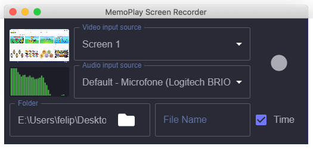
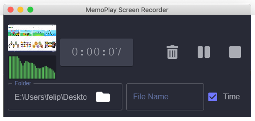
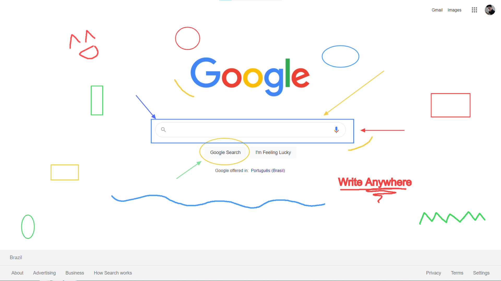

# MemoPlay Screen Recorder - メモプレイ

A Free Simple Screen Recorder with annotation tools. Made with Electron.







---

## Table of contents

-   [Download](#download)
-   [Features](#features)
-   [Supported File Formats](#supported-file-formats)
-   [Hotkeys and commands](#hotkeys-and-commands)

---

## Download

-   [Windows](https://github.com/mewters/memoplay-screen-recorder/releases/download/v2.1.0/MemoPlay.Setup.2.1.0.exe)

---

## Features

🎥 Make unlimited recordings of your screen or any application window

✏️ Annotate by drawing anywhere on the screen, writing text, creating arrows, circles and rectangles

📼 WebM videos with no video length bug

🕒 Automatic timestap on file name (optional)

⏯️ Pause while recording

🎤 Microphone monitoring (optional)

📺 Floating window for video monitoring (optional)

---

## Supported File Formats

-   .webm (no video length bug 😁)
-   .mp4
-   .avi (soon)

---

## Hotkeys and Commands

| Function                   | Windows / Linux | Mac          |
| -------------------------- | --------------- | ------------ |
| Start/Stop Annotation Tool | F8              | Cmd+Shift+1  |
| Start Recording            | F9              | Cmd+Shift+2  |
| Pause/Resume Recording     | F9              | Cmd+Shift+2  |
| Stop Recording             | F10             | Cmd+Option+2 |

### On the Screen Recorder

| Function                     |                                |
| ---------------------------- | ------------------------------ |
| Stop Microfone Monitoring    | Click on the Microfone Monitor |
| Toggle floating video window | Click on the Video Monitor     |

### On the Annotation Tool

| Function  |                                                 |
| --------- | ----------------------------------------------- |
| Select    | Space                                           |
| Draw      | 1                                               |
| Arrow     | 2                                               |
| Circle    | 3                                               |
| Rectangle | 4                                               |
| Text      | 5 or T                                          |
| Remove    | Backspace or Delete                             |
| Clear All | Shift + Delete                                  |
| Copy      | Ctrl + C or Cmd + C                             |
| Paste     | Ctrl + V or Cmd + V                             |
| Cut       | Ctrl + X or Cmd + X                             |
| Duplicate | Ctrl + D or Cmd + D                             |
| Undo      | Ctrl + Z or Cmd + Z                             |
| Redo      | Ctrl + Y or Ctrl + Shift + Z or Cmd + Shift + Z |
| Menu      | Right Mouse Button                              |

---

## Starting Development

Start the app in the `dev` environment:

```bash
yarn start
```

## Packaging for Production

To package apps for the local platform:

```bash
yarn package
```

## Known Issues

-   Sometimes the `undo / redo` actions may break the application

---

## Donations
