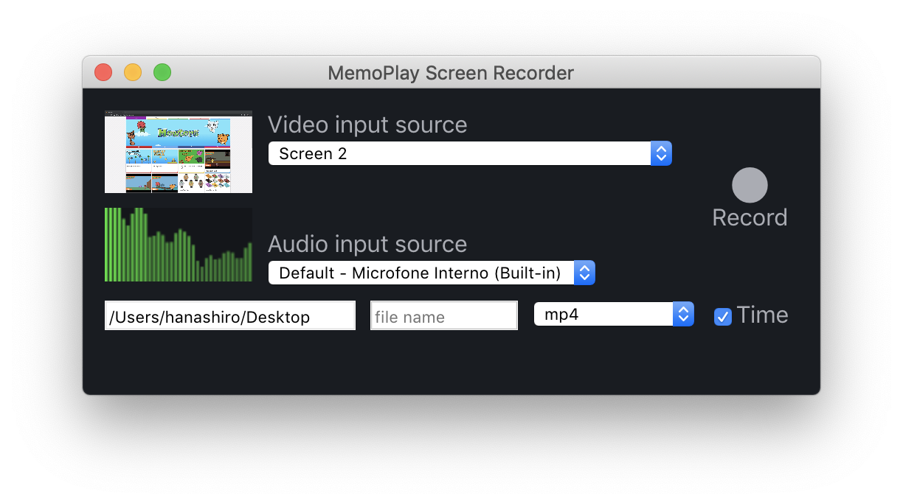

# MemoPlay Screen Recorder
メモプレイ

Simple Screen Recorder made with Electron.

## Instalation

### NPM
> $ npm i -g @mewters/memoplay-screen-recorder

To start, execute:
> $ memoplay

## Hotkeys
| Function | Windows / Linux | Mac |
| ------ | ------ |  ------ | 
| Start Recording | F9  | Cmd+Shift+2 |
| Pause/Resume Recording | F9  | Cmd+Shift+2 |
| Stop Recording | F10  | Cmd+Option+2 |

## Supported File Formats

- .webm (default)
- .mp4
- .avi